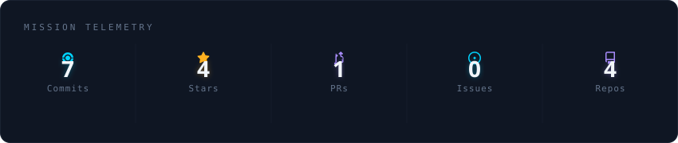

  

 

  

 

  

 

  

## Bio

Formado em Análise e Desenvolvimento de Sistemas pela Estácio, com pós-graduação em Testes de Software na Unyleya (em andamento) e certificação **ISTQB® Foundation Level 4.0** (`26-CTFL-15087-BR`). Com **+5 anos** de experiência em QA, atuo com testes manuais e automatizados em aplicações **Web, APIs e Mobile**.

Hoje sou Analista de Testes na **Feng Brasil**, com qualidade em produtos de e-commerce e sócio-torcedor (Nação Flamengo, Nação Prêmios, SPFC e Botafogo). Antes: Arquiteto de Testes na Spread (Vivo — Sinfonia CX), AchieveMore e Biz.

## Specializations

- QA Engineering e práticas de automação
- Testes exploratórios e funcionais
- Automação Web, Mobile e API
- Testes de performance
- Shift Left, BDD e qualidade em CI/CD
- Evidências claras para decisão de release

## Technologies and Tools

- Automation: Playwright, Cypress, Selenium, Robot Framework, Postman, Swagger
- CI/CD: GitHub Actions, Azure DevOps
- Languages: TypeScript, JavaScript, Python
- API testing: REST, Postman, Swagger
- Database: PostgreSQL, MySQL, Oracle, SQL
- Performance: k6, JMeter
- Management: Jira, Kanban, Scrum
- Patterns: Page Object Model, BDD

## Connect with Me

  
  
  
  

## License

This project is licensed under the MIT License.
